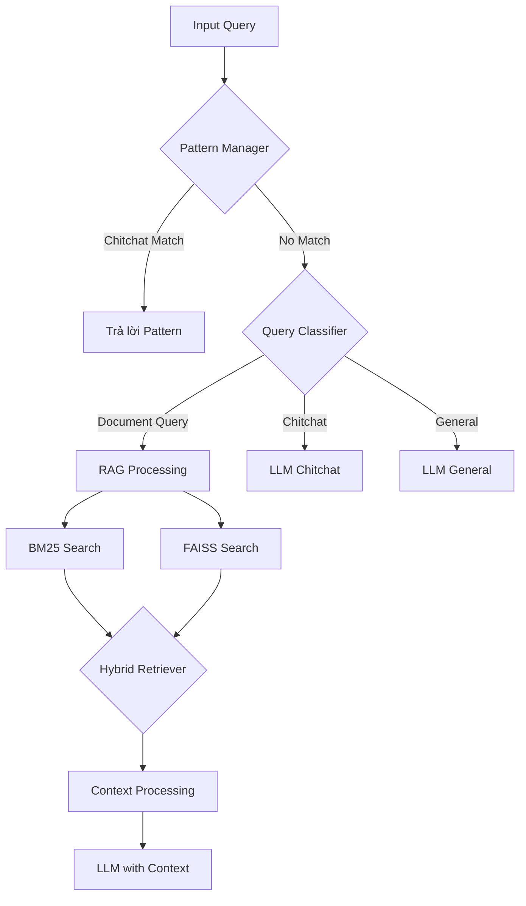

# Hệ Thống RAG (Retrieval-Augmented Generation) với VinaLLaMA


## �� Tổng Quan
Hệ thống kết hợp VinaLLaMA với BM25 và FAISS để xây dựng chatbot thông minh có khả năng:
- Trò chuyện thông thường (chitchat)
- Trả lời câu hỏi dựa trên tài liệu (document QA)
- Phân loại và xử lý câu hỏi thông minh

## 🧠 Kiến Trúc Hệ Thống

### 1. Xử Lý Dữ Liệu (text_processing.py)
- Đọc file PDF bằng PyPDFLoader
- Chia nhỏ văn bản thành chunks 512 ký tự, overlap 100
- Tạo embeddings bằng GPT4AllEmbeddings
- Lưu vector trong FAISS với METRIC_INNER_PRODUCT

### 2. Quản Lý Pattern (pattern_manager.py)
- **Chitchat Patterns**: 
  - Xử lý 20+ loại câu hỏi thông thường (chào hỏi, cảm xúc, thời tiết...)
  - Mỗi pattern có trọng số riêng (greeting: 1.5, emotion: 1.3...)
  
- **Document Patterns**:
  - Nhận diện 15+ loại câu hỏi về tài liệu (what, how, why...)
  - Trọng số theo độ phức tạp (technical: 1.5, analyze: 1.3...)

### 3. Xử Lý Câu Hỏi (smart_ans.py)
**Luồng xử lý**:
1. Phân loại câu hỏi (classify_query):
   - Tính điểm chitchat và document dựa trên pattern matching
   - Trả về (query_type, confidence, intent)

2. Kiểm tra pattern có sẵn:
   - Nếu match với chitchat pattern -> trả lời ngay
   - Nếu là document query -> chuyển sang RAG
   - Nếu không rõ -> xử lý bằng LLM

3. RAG Processing:
   - Sử dụng hybrid_retriever kết hợp BM25 và FAISS
   - Lấy top 3 kết quả từ mỗi phương pháp
   - Loại bỏ trùng lặp
   - Đưa context vào prompt template

### 4. Tìm Kiếm Lai (utils.py)
- Kết hợp kết quả từ BM25 và FAISS
- Xử lý query với nhiều biến thể
- Loại bỏ stopwords tiếng Việt
- Sắp xếp kết quả theo độ liên quan

## 🎯 Các Tham Số Quan Trọng

### LLM Configuration
- Temperature: 0.2 (ưu tiên câu trả lời chính xác)
- Max tokens: 128 (câu trả lời ngắn gọn)
- Top_k: 30, Top_p: 0.9 (cân bằng đa dạng/chính xác)

### RAG Parameters
- Chunk size: 512 characters
- Chunk overlap: 100 characters
- Search results: Top 3 từ mỗi phương pháp
- MMR lambda: 0.7 (cân bằng relevance/diversity)

## 🔍 Logic Xử Lý Chi Tiết

1. **Tiền xử lý câu hỏi**:
   - Chuẩn hóa text (lowercase, remove special chars)
   - Tạo biến thể câu hỏi
   - Loại bỏ stopwords

2. **Phân loại câu hỏi**:
   - Chitchat: score >= 1.0
   - Document: score >= 0.8
   - General: các trường hợp còn lại

3. **Xử lý RAG**:
   - Truy vấn song song BM25 và FAISS
   - Kết hợp và loại trùng kết quả
   - Format prompt với context

4. **Tối ưu câu trả lời**:
   - Loại bỏ lặp lại câu hỏi
   - Trả lời ngắn gọn, súc tích
   - Thêm metadata (intent, confidence)

## 🔄 Flowchart Hệ Thống



## 🛠️ Yêu Cầu Hệ Thống
- Python 3.8+
- LangChain
- FAISS
- PyPDF2
- CTransformers
- GPT4All


## 📊 Chi Tiết Xử Lý

### 1. Pattern Manager
- **Chức năng**: Quản lý và nhận diện mẫu câu
- **Patterns**:
  ```python
  chitchat_patterns = {
    'greeting': r'(xin chào|hello|hi|chào|hey)',
    'family': r'(gia đình|nhà|bao nhiêu người)',
    ...
  }
  
  doc_patterns = {
    'what': r'(là gì|như thế nào|ra sao)',
    'how': r'(làm sao|cách|phương pháp)',
    ...
  }
  ```

### 2. Query Classification
- **Input Processing**:
  - Lowercase, remove special chars
  - Tokenization và stopword removal
- **Scoring System**:
  ```python
  weights = {
    'greeting': 1.5,
    'technical': 1.5,
    'analyze': 1.3,
    ...
  }
  ```
- **Thresholds**:
  - Chitchat: score ≥ 1.0
  - Document: score ≥ 0.8

### 3. RAG Processing
- **Hybrid Search**:
  1. BM25 Search:
     - Lexical matching
     - Top 3 kết quả
  2. FAISS Search:
     - Semantic matching
     - Top 3 kết quả
  3. Kết hợp và loại trùng

- **Context Processing**:
  - Chunk size: 512 chars
  - Overlap: 100 chars
  - Format: Markdown

### 4. LLM Integration
- **Models**:
  - VinaLLaMA 7B Chat
  - Quantized: GGUF format
  
- **Prompts**:
  1. Document QA:
  ```
  Context: {context}
  Question: {question}
  Yêu cầu: [chi tiết yêu cầu]
  ```
  
  2. Chitchat:
  ```
  Question: {question}
  Intent: {intent}
  Confidence: {confidence}
  ```

## 🎯 Use Cases

### 1. Truy vấn Tài liệu

User: "Giải thích về khái niệm RAG là gì?"
→ Pattern: doc_patterns["what"]
→ Classification: document (score: 1.3)
→ RAG Processing
→ LLM Response

### 2. Trò chuyện

User: "Chào bạn, bạn khỏe không?"
→ Pattern: chitchat_patterns["greeting", "health"]
→ Direct Response

User: "Bạn thích màu gì nhất?"
→ No Pattern Match
→ Classification: general
→ LLM General Response

### 3. Câu hỏi Tổng quát

User: "Tôi có thể làm gì để bảo vệ môi trường?"
→ Pattern: general
→ Classification: general
→ LLM General Response


## 📝 License
MIT License BaoHan1712